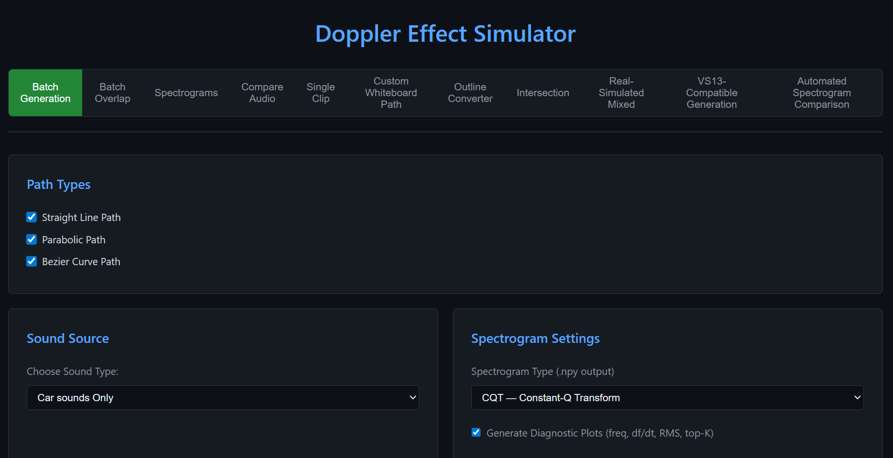

# Doppler Effect Simulator (DopplerSim)

A Flask-based system for generating realistic Doppler-shifted vehicle audio clips for research purposes, dataset creation, and acoustic modeling experimentation. Supports batch, overlapping, and single-clip generation using straight-line, parabolic, and Bezier paths with physically accurate Doppler and distance attenuation.

---

## Features

### Core Capabilities
- **Realistic Doppler Shift**: Simulation based on acoustic wave propagation physics with continuous time-domain Doppler modulation for realistic vehicle pass-by audio generation.
- **Multiple Vehicle Trajectories**:
  - **Straight Line**: Standard pass-by with configurable closest point of approach (CPA).
  - **Parabolic**: Curved path simulation.
  - **Bezier Curve**: Complex multi-point cubic trajectories.
- **Batch Overlap (Busy Road)**: Simulate multiple vehicles with staggered starts and lane offsets to create complex acoustic scenes.
- **Drone Support**: specialized support for drone sound libraries and flight dynamics.
- **Adaptive Physics**: Physically correct 1/R spherical spreading for distance-based amplitude shaping.
- **Automated Visualizations**: Generates path plots and spectrograms for every audio clip generated.

### UI Functionality

- **Multi-Mode Web Interface**:
  - **Batch Generation**: Large scale dataset creation with randomized or user-defined parameters.
  - **Batch Overlap**: Complex scene generation for multi-target tracking research.
  - **Spectrograms**: dedicated tool for analyzing sound files and generating visual high-resolution spectrograms.
  - **Single Clip**: Instant preview mode for parameter tuning.
- **Vehicle Management**: Library upload, validation (3.0s duration check), and live management.
- **Real-time Plotting**: Live preview of vehicle paths on a canvas.

---

## Project Structure

```
DopplerSim/
├── core/
│   ├── config.py            # Environment, dirs, and default parameter ranges
│   ├── progress.py          # Batch progress tracking
│   └── sampler.py           # Cyclic parameter sampling
├── physics/
│   ├── straight_line.py     # Straight line Doppler model logic
│   ├── parabola.py          # Parabolic path logic
│   └── bezier.py            # Bezier curve logic
├── audio/
│   ├── audio_utils.py       # Doppler, amplitude, and resampling utilities
│   └── generation.py        # Batch generation and distribution logic
├── visualization/
│   ├── graphs.py            # Shared plotting logic for paths and stats
│   ├── plot_utils.py        # Low-level trajectory plotting
│   └── validation.py        # Path validation and scene checks
├── routes/                  # Flask Route Blueprints
│   ├── batch_routes.py
│   ├── simulate_routes.py
│   └── vehicle_routes.py
├── static/                  # Audio, Metadata, and Image storage
├── templates/               # UI components
├── app_batch.py             # Main Flask entry point
├── requirements.txt         # Project dependencies
└── README.md
```

---

## Installation

### Prerequisites
- Python 3.9+
- pip and virtual environment support

### Setup

```bash
# Enter the project directory
cd DopplerSim

# Create and activate virtual environment
python -m venv venv
source venv/bin/activate      # Windows: venv\Scripts\activate

# Install dependencies
pip install -r requirements.txt
```

---

## Running the Application

```bash
python3 app_batch.py
```
The server will start at: `http://localhost:5050`

---

## Operational Modes

### 1. Batch Generation
Used to create large-scale datasets for machine learning.
1. Select path types (Multiple can be selected).
2. Choose sound source (Cars/Drones).
3. Set ranges for speed, distance, and angle.
4. Define total clips and distribution mode (Automatic or Manual).
5. **Output**: Folders containing WAVs, metadata.json, path plots, and spectrograms.

### 2. Batch Overlap (Busy Road Simulation)
Simulates realistic environments with multiple vehicles.
1. Define number of scenes.
2. Set range of vehicles per scene.
3. Configure lane width and maximum stagger (delay between vehicle starts).
4. **Output**: A "mixed_audio.wav" per scene along with individual vehicle tracks and a combined path plot.

### 3. Spectrogram Analysis
Analysis tool for sound libraries.
- Upload any audio file to generate a high-quality spectrogram.
- View and analyze the frequency distribution of vehicle sounds before generation.

### 4. Single Clip Generation
Instant simulator for testing specific parameters.
- Control every aspect of a single vehicle's path.
- Play and download results immediately.

### 5. Benchmark Suite (B1-B10)
DopplerSim introduces a comprehensive suite of ten foundational tasks designed to evaluate whether models understand motion as a physical process:

- **B1: Speed Estimation**: Predict continuous velocity ($v_i$) or discrete speed bins ($b_i$). Evaluates whether models can distinguish speed-related acoustic structure from nuisance variations.
  $$MAE_{speed} = \frac{1}{N} \sum_{i=1}^{N} |\hat{v}_i - v_i|$$
  $$RMSE_{speed} = \sqrt{\frac{1}{N} \sum_{i=1}^{N} (\hat{v}_i - v_i)^2}$$
  $$Acc_{speed-bin} = \frac{1}{N} \sum_{i=1}^{N} \mathbf{1}[\hat{b}_i = b(v_i)]$$

- **B2: Direction-of-Travel**: Classify relative motion ($y^{dir}_i \in \{\text{approaching}, \text{receding}, \text{lateral}\}$). Probes whether models use asymmetric time-frequency structure over time.
  $$Acc_{dir} = \frac{1}{N} \sum_{i=1}^{N} \mathbf{1}[\hat{y}^{dir}_i = y^{dir}_i]$$

- **B3: Distance-of-Closest-Approach**: Estimate the minimum source-sensor distance ($d^{CPA}_i$) over a clip. Tests physically meaningful geometric inference from time-varying audio.
  $$d^{CPA}_i = \min_{t \in [0, T_i]} \|\mathbf{p}_i(t) - \mathbf{o}\|$$
  $$RMSE_{CPA} = \sqrt{\frac{1}{N} \sum_{i=1}^{N} (\hat{d}^{CPA}_i - d^{CPA}_i)^2}$$

- **B4: Trajectory Shape**: Classify the trajectory family ($y^{traj}_i \in \{\text{straight}, \text{parabola}, \text{bezier}\}$). Asks the model to identify the global structure of movement.
  $$Acc_{traj} = \frac{1}{N} \sum_{i=1}^{N} \mathbf{1}[\hat{y}^{traj}_i = y^{traj}_i]$$
  $$L_{traj} = - \frac{1}{N} \sum_{i=1}^{N} \sum_{k=1}^{K} \mathbf{1}[y^{traj}_i = k] \log p_{ik}$$

- **B5: Time-to-Event**: Predict time remaining until a key event like closest approach ($\tau_i(t) = \max(0, t^{CPA}_i - t)$). Tests predictive temporal forecasting from partial observations.
  $$RMSE_{\tau} = \sqrt{\frac{1}{N} \sum_{i=1}^{N} (\hat{\tau}_i - \tau_i)^2}$$

- **B6: Motion State Segmentation**: Perform framewise sequence labeling of motion states ($y^{seg}_{i,n}$). Tests temporal precision and transition localization.
  $$Acc_{frame} = \frac{\sum_{i=1}^{N} \sum_{n=1}^{T_i} \mathbf{1}[\hat{y}^{seg}_{i,n} = y^{seg}_{i,n}]}{\sum_{i=1}^{N} T_i}$$
  $$mIoU = \frac{1}{C} \sum_{c=1}^{C} \frac{TP_c}{TP_c + FP_c + FN_c}$$

- **B7: Acceleration / Deceleration**: Estimate acceleration magnitude ($a_i$) or classify motion state. Tests higher-order kinematic structure inference.
  $$a_i = \frac{d v_i(t)}{dt}$$
  $$RMSE_a = \sqrt{\frac{1}{N} \sum_{i=1}^{N} (\hat{a}_i - a_i)^2}$$

- **B8: Multi-Object Disentanglement**: Resolve multiple concurrent sources and estimate their individual attributes ($\mathbf{z}_{i,m}$). Tests disentanglement of overlapping acoustic processes.
  - Permutation invariant error: 
    $$E_{PI}^{(i)} = \min_{\pi \in S_{M_i}} \frac{1}{M_i} \sum_{m=1}^{M_i} d(\hat{\mathbf{z}}_{i,\pi(m)}, \mathbf{z}_{i,m})$$

- **B9: Crossing and Interaction**: Classify scene-level interactions ($y^{cross}_i$). Evaluates relational reasoning among moving objects.
  $$y^{cross}_i = \mathbf{1}\left[\min_t \|\mathbf{p}_{i,1}(t) - \mathbf{p}_{i,2}(t)\| < \delta\right]$$
  $$Acc_{cross} = \frac{1}{N} \sum_{i=1}^{N} \mathbf{1}[\hat{y}^{cross}_i = y^{cross}_i]$$

- **B10: Source Identity**: Identify source class ($y^{id}_i$) invariant to motion condition. Tests if a model can disentangle intrinsic source characteristics from motion-induced distortion.
  $$Acc_{id} = \frac{1}{N} \sum_{i=1}^{N} \mathbf{1}[\hat{y}^{id}_i = y^{id}_i]$$

**Usage**: Use the **Benchmark Mode** in the Batch Generation tab or run:
```bash
python benchmarks/benchmark_suite.py --generate --num_samples 5
```

---

## External Dataset: VS13

DopplerSim includes specialized support for the **VS13 Vehicle Speed Dataset**, a collection of recordings designed for research in acoustic vehicle speed estimation.

Although the original VS13 dataset contains recordings from 13 vehicle models, this work utilizes recordings from only the following 6 vehicles:
- **Kia Sportage**
- **Nissan Qashqai**
- **Peugeot 3008**
- **Peugeot 307**
- **Renault Scenic**
- **VW Passat B7**

Additional dataset details:
- **Coverage**: Vehicle recordings at speeds ranging from 30 km/h to 105 km/h.
- **Format**: `.wav` audio files with corresponding `.txt` ground-truth annotations containing speed and CPA timing information.

---

## Synthesis Pipeline

The DopplerSim engine follows a signal-flow oriented architecture that transforms stationary source recordings into physically consistent pass-by audio.

1. **Waveform Preparation**: Short monophonic vehicle recordings are resampled to the engine rate (22,050 Hz), peak-normalized, and extended with overlap crossfades if the requested duration exceeds the library length.
2. **Motion Computation**: The active trajectory model (Straight, Parabola, Bezier, or Map polyline) determines the source position $\mathbf{p}(t)$, tangent velocity $\mathbf{v}(t)$, range $r(t)$, and radial velocity $v_r(t)$ at every output sample.
3. **Driving Curve Generation**: The engine evaluates the instantaneous frequency ratio $\rho(t)$ and a non-negative gain $g(t)$. The gain is built from softened geometric spreading (inverse range), a convective amplitude factor, listener compression, and end fades.
4. **Retarded-Time Alignment**: For accelerated paths, ratio and gain sequences are re-interpolated onto an approximate arrival-time grid to align kinematic changes with the sound's travel time to the observer.
5. **Audio Synthesis**: The source audio is processed through a variable-rate time-domain warp driven by the frequency-ratio curve using cubic interpolation, then multiplied sample-wise by the gain sequence. The resulting waveform is shifted by an initial propagation delay corresponding to the starting source range.

---

## Physics & Kinematics

DopplerSim utilizes a physically-grounded synthesis engine to model the acoustic transformation of moving sources. The following sections detail the core mathematical framework.

### 1. Atmospheric Speed of Sound
The speed of sound $c$ is calculated based on ambient temperature $T$ (°C) and relative humidity $RH$ (%):
- **Dry Air Base**: 
  $$c_{dry}(T) = 331.3 \sqrt{1 + \frac{T}{273.15}}$$
- **Humidity Correction**: 
  $$c(T, RH) = c_{dry}(T) + 0.6 \frac{RH}{100}$$
This centers both the Doppler ratio and the convective amplitude factor.

### 2. Kinematic Path Modeling
Sources follow a planar curve $\mathbf{p}(t)$ with velocity $\mathbf{v}(t)$ tangent to the path.
- **Position Interpolation**: 
  $$\mathbf{p}(t) = (1 - \lambda(t)) \mathbf{q}_j + \lambda(t) \mathbf{q}_{j+1}$$
- **Tangential Speed with Acceleration**: 
  $$s(\Delta t) = v_0 \Delta t + \frac{1}{2} a (\Delta t)^2$$
- **Radial Velocity**: 
  $$v_r(t) = \mathbf{v}(t) \cdot \frac{(\mathbf{p}(t) - \mathbf{o})}{\|\mathbf{p}(t) - \mathbf{o}\|}$$
  *(where $\mathbf{o}$ is the observer position)*

### 3. Acoustic Wave Modeling
The received waveform $y[n]$ is generated by warping the resampled source signal $\tilde{x}[n]$ and applying gain $g[n]$:

#### Doppler Warping (Frequency Ratio)
The emitted-to-received frequency ratio $\rho(t)$ is governed by the standard kinematic Doppler expression:
$$\rho(t) = \frac{f'(t)}{f_0} = \frac{c}{c + v_r(t)}$$
*(Note: Formulated as $\frac{c}{c - v_r(t)}$ in contexts with an opposite radial velocity sign convention.)*

#### Gain and Attenuation
The raw gain $g_{raw}(t)$ combines geometric spreading and convective effects. Amplitude is modulated as a function of distance:
- **Geometric Spreading**: 
  $$A_{sp}(t) = \frac{1}{\sqrt{\|\mathbf{p}(t) - \mathbf{o}\|^2 + R_{nf}^2}}$$
  *(with near-field radius $R_{nf} = 6m$ stabilizing near-field behavior)*
- **Convective Factor**: 
  $$A_{conv}(t) = \left(\frac{c}{c + v_r(t)}\right)^{1.1}$$
- **Total Gain**: 
  $$g_{raw}(t) = (G_0 A_{sp}(t) A_{conv}(t))^\gamma$$
  *(Default constants: $G_0 = 10$, $\gamma = 0.7$)*

#### Multi-Object Scene Composition
To model scenes with multiple moving sources, the synthesis framework combines independent trajectories into a single composite waveform:
$$x(t) = \sum_{i=1}^{N} A_i(t) \cdot s'_i(t)$$
where $s'_i(t)$ denotes the Doppler-transformed signal of source $i$ and $A_i(t)$ represents its amplitude envelope.

#### Motion Field Decomposition
To efficiently reconstruct complex acoustic motion fields (e.g., using Physics-Informed Neural Networks), the continuous space-time domain $\Omega$ can be partitioned into localized subdomains $\Omega_k$:
$$\Omega = \bigcup_k \Omega_k$$
Each subdomain models a region with more homogeneous physical behavior, facilitating scalable learning and disentanglement.

### 4. Propagation & Timing
- **Retarded-Time Alignment**: When tangential acceleration is non-zero, emission ($t_{emit}$) and observation ($t_{obs}$) times are approximately related to align kinematic changes with sound travel time:
  $$t_{obs} \approx t_{emit} + \frac{r(t_{emit}) - r_{cpa}}{c}$$
  where $r(t_{emit})$ is the source-to-microphone distance at the emission moment, and $r_{cpa}$ is the closest-approach distance.
- **Discrete Output**: The final resampled waveform is computed using cubic interpolation:
  $$y[n] = g[n] \tilde{x}[n]$$

---

## Publication Reference

This codebase supports the following research paper:

**Dynamic Audio Motion Understanding: Benchmarking Physical Motion Inference from Sound**  
*Submitted for NeurIPS 2026 (Evaluations and Datasets Track)*
